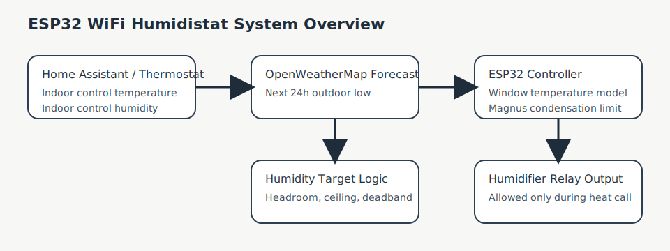

# Theory

## Goal

The controller tries to maintain the highest practical indoor humidity without allowing condensation to form on interior window surfaces.

This is a condensation-prevention problem, not just a comfort-control problem.

## Why Windows Matter

Indoor air can be safe at one humidity level near the thermostat but still condense on a colder surface somewhere else. In most homes, the coldest routine interior surface in winter is the edge or bottom of a window.

That means the limiting factor is usually not:

- the thermostat reading
- the middle of the room
- the average wall temperature

The limiting factor is the coldest condensation-prone glass surface.

## Dew Point and Condensation

Air can hold more moisture at warmer temperatures and less at colder temperatures.

Condensation forms when a surface temperature drops to or below the dew point of the indoor air.

In practical terms:

- warmer glass allows higher indoor RH
- colder glass requires lower indoor RH

## System Inputs

The humidistat uses:

- indoor control temperature from the thermostat
- indoor control humidity from the thermostat
- forecast outdoor low temperature
- a window temperature model

## Window Surface Temperature Estimate

The current model is:

```cpp
float t_surf_f =
    t_in_f -
    (R_film / R_win) *
    (t_in_f - t_out_f);
```

Where:

- `t_in_f` is indoor air temperature
- `t_out_f` is forecast outdoor low temperature
- `R_film` models interior air film resistance
- `R_win` models the effective thermal resistance of the coldest window region

This is intentionally conservative. `R_win` does not represent the best part of the window. It represents the most condensation-prone part of the glass that matters operationally.

## Magnus Equation

Once the controller estimates the interior surface temperature, it calculates the maximum indoor RH that would avoid condensation on that surface:

```cpp
float rh_physics = 100.0f * expf(
  17.27f * t_surf_c / (243.04f + t_surf_c)
  - 17.27f * t_in_c / (243.04f + t_in_c)
);
```

This is the condensation limit.

## Final Humidity Target

The controller then applies practical operating limits:

```cpp
rh_target = rh_physics;
rh_target -= RH_headroom;

if (rh_target > RH_ceiling)
  rh_target = RH_ceiling;

if (rh_target < 0)
  rh_target = 0;
```

This means:

- `RH_headroom` adds safety margin below the calculated condensation limit
- `RH_ceiling` enforces a comfort or policy maximum

## Why Forecast Low Temperature Is Used

The controller uses the coldest forecasted temperature in the next 24 hours because condensation risk often happens later than the moment you look at the dashboard.

This makes the control more predictive than reactive.

## System Overview



## Important Limits

This is still an estimate-based controller. Accuracy depends on:

- thermostat sensor accuracy
- forecast accuracy
- how well `R_win` matches your actual window edge temperature

If your windows are colder than the model assumes, condensation can still occur. If the model is too conservative, the home may feel drier than necessary.
