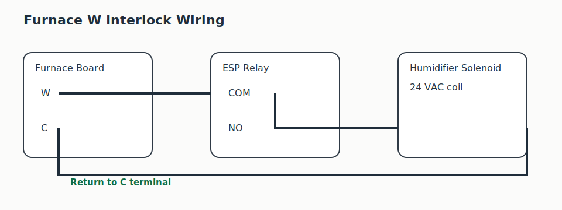

# Wiring

## Design Goal

The humidifier must only run during a heat call.

This project intentionally uses a hardware interlock on the furnace `W` circuit so the ESP cannot energize the humidifier when the furnace is not actively calling for heat.

## Terminal Assumptions

Typical furnace board terminals:

```text
R
C
W
Y
G
```

This design assumes there is no dedicated `HUM` terminal.

## Recommended Interlock Wiring

```text
W terminal
  ->
ESP relay COM
  ->
ESP relay NO
  ->
Humidifier solenoid
  ->
C terminal
```

This means water flows only when:

```text
W is energized
AND
the ESP relay is closed
```

## Relay Contacts

Use:

- `COM`
- `NO`

Do not use `NC` for this design.

## ASCII Wiring Diagram

```text
              Furnace Control Board
         ┌────────────────────────────┐
         │                            │
         │   W o------------------.   │
         │                        |   │
         │   C o------------------+------------------------.
         │                        |                        |
         └────────────────────────|────────────────────────|
                                  |                        |
                                  v                        v
                           ESP Relay COM              Humidifier
                                  |                  Solenoid Coil
                           ESP Relay NO                    |
                                  '------------------------'
```

## Safety Notes

- Verify the humidifier solenoid voltage before wiring
- Verify the relay contact rating is appropriate
- Keep low-voltage control wiring isolated from mains wiring
- Confirm the `W` terminal is the actual heat-call path on your system

## What Not To Do

Do not wire the humidifier directly from `R` to the solenoid in this project. That bypasses the heat-call interlock and defeats a key safety assumption in the control design.

## Visual Reference


